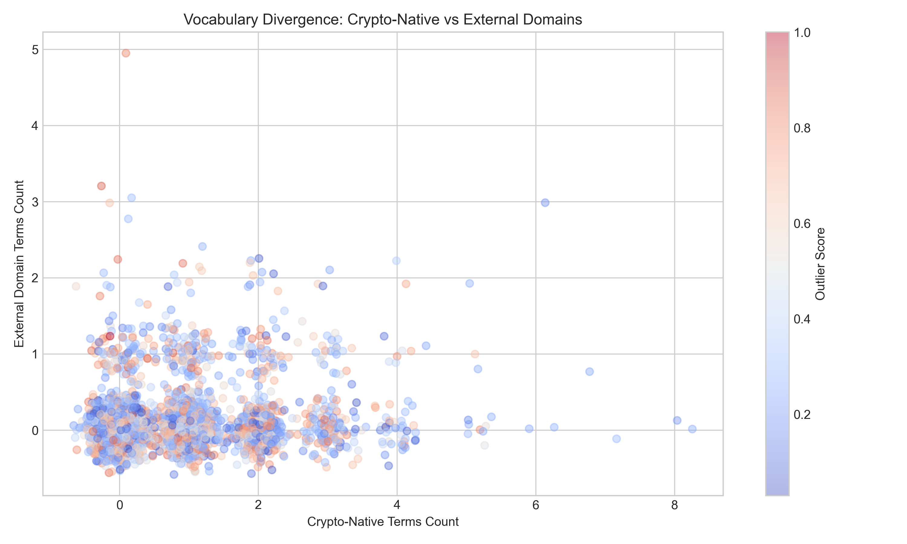
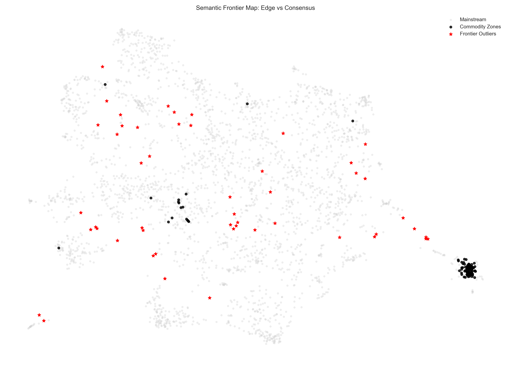
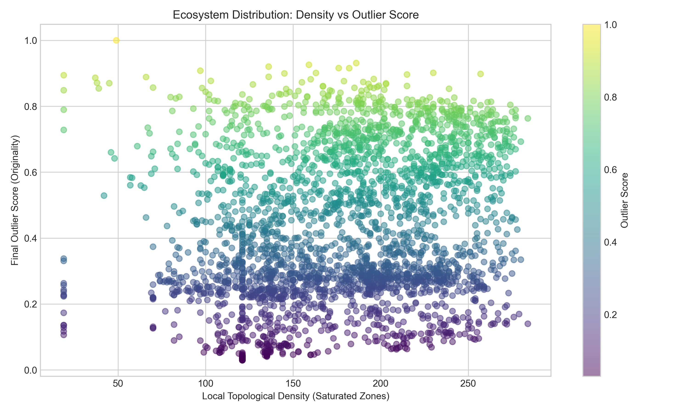

# Frontier Outlier Intelligence Report
> Edge-of-search-space ecosystem intelligence.
> Identifying projects furthest from ecosystem consensus.

## Executive Summary

Innovation in the Frontier ecosystem is not evenly distributed. The majority of projects cluster tightly around established narratives, creating high-density commodity zones. A small minority of builders operate at the "edge of the search space"—importing problems from external domains, inventing new semantic archetypes, and occupying sparse topological regions.

This report maps the Frontier Outlier class.

---

## I. Top 25 Most Structurally Original Projects

These projects rank highest on the composite `final_outlier_score` (measuring semantic distance, neighborhood sparsity, archetype uniqueness, and external vocabulary).

| project_name                                        |   final_outlier_score | archetype                                         | what_is_actually_built                                                                                                                                                                                                                                                                                                                                                                                                                                                                                                                                                                                       |
|:----------------------------------------------------|----------------------:|:--------------------------------------------------|:-------------------------------------------------------------------------------------------------------------------------------------------------------------------------------------------------------------------------------------------------------------------------------------------------------------------------------------------------------------------------------------------------------------------------------------------------------------------------------------------------------------------------------------------------------------------------------------------------------------|
| Face emotion recognition                            |                 1.000 | EMOTION_DETECTION_SYSTEM                          | A model designed to be lightweight and efficient for face-emotion detection, built using Python and machine learning.                                                                                                                                                                                                                                                                                                                                                                                                                                                                                        |
| StarkFi                                             |                 0.931 | EMBEDDED_FINANCE_API                              | The project has real contracts, 40 partners testing the API, and six large firms sending season makers. It includes a shared KYC system and soulbound tokens.                                                                                                                                                                                                                                                                                                                                                                                                                                                |
| Sinergy                                             |                 0.926 | CROSS_BORDER_PAYMENT_ORCHESTRATOR                 | A platform that allows companies to register beneficiaries, upload payment batches, review quotes with fees, approve payouts, fund payments using USDC on Solana, and execute local fiat payments to workers in countries like Colombia and Mexico. It includes features for approvals, reconciliation, traceability, audit logs, and exception handling.                                                                                                                                                                                                                                                    |
| Casi                                                |                 0.920 | LIVE_STREAM_INTERACTION_OVERLAY                   | A Next.js web application is built, live on devnet at casi.gg. It includes a payment rail for Stripe and a Solana payment rail with a smart contract. The free side and Stripe side are described as 'good to go'. The Solana program (Anchor) is built as a time-vested USDC escrow.                                                                                                                                                                                                                                                                                                                        |
| Fractionax An Agentic RWA Investment Infrastructure |                 0.916 | AI_AGENT_RWA_INVESTMENT_MANAGER                   | A system that allows users to input investment goals for RWAs, which then uses agents to source deals, assess rates, execute transactions on-chain, and manage the portfolio continuously.                                                                                                                                                                                                                                                                                                                                                                                                                   |
| VeraNexus                                           |                 0.916 | AI_RWA_BROKERAGE_AGENT                            | The project combines on-chain accredited investor credentials (SSAS), an AI agent with autonomous on-chain payment capability, and functionalities for RWA trading lifecycle including price aggregation, subscription/redemption, and portfolio management. It also generates AI-generated investment reports.                                                                                                                                                                                                                                                                                              |
| OpenTrade — The World's Stock Market on Solana      |                 0.908 | TOKENIZED_SECURITIES_BROKERAGE                    | A mobile application that facilitates the purchase of US stocks using USDC on Solana. The mechanism for representing and transferring 'real US stocks' on Solana is unclear.                                                                                                                                                                                                                                                                                                                                                                                                                                 |
| Lowkie                                              |                 0.901 | INSTITUTIONAL_SETTLEMENT_INFRASTRUCTURE           | An execution architecture and a policy engine have been built. This system performs four pre-chain checks (allow lists, amount threshold, sanctions screening, jurisdiction). It executes a fragmented time settlement flow on Solana and produces a 'finance grid' with a 'constellation record' and selected disclosure post-execution.                                                                                                                                                                                                                                                                    |
| SolanaCreds                                         |                 0.901 | ONCHAIN_CREDENTIAL_PLATFORM                       | A user interface for browsing a marketplace, creating a new token (credential), and viewing certifications is demonstrated. The process of issuing a credential and the concept of selling access to a course are shown.                                                                                                                                                                                                                                                                                                                                                                                     |
| VAULTLESS                                           |                 0.900 | BEHAVIORAL_BIOMETRIC_AUTHENTICATION_SYSTEM        | A behavioral biometric authentication system prototype that captures keystroke timing, flight time, mouse velocity, acceleration, and interaction rhythm. A real-time comparison system using Z-score normalization and cosine similarity for authentication. A "Ghost Wallet" protocol that redirects attackers to a simulated dashboard and sends alert emails. A biometric lab for visual data comparison. A mobile application capturing stress, code duration patterns, and gyroscopy motion data. A platform-agnostic SDK called "waterless code." A live web app, a mobile app, and a standalone SDK. |
| Agora                                               |                 0.898 | VERIFIABLE_AI_DELIBERATION_ENGINE                 | The project has built deliberation engines, a functional debate system, an ISD weighted voting engine, a pump sensor and selector for real-time mechanism learning, and tool-calling functionality for agents (web search, file analysis, code execution in a sandbox). A front-end visualizes agent activity, tool calls, entropy metrics, and consensus forms. A benchmark dashboard with a heatmap and analytics is also built. Declarations are set up in Google's library, and Solana contracts are deployed.                                                                                           |
| Vault1177                                           |                 0.896 | SUPPLY_CHAIN_FINANCE_PLATFORM                     | A payment platform user interface was built, allowing users to log in as a contractor, connect a Phantom wallet, view existing invoices and claims, create new invoices, generate payment requests, and process USDC transfers on the Solana testnet, with transactions verifiable on the Solana explorer.                                                                                                                                                                                                                                                                                                   |
| ValyCare                                            |                 0.894 | VERIFIABLE_CHECK_IN_SYSTEM                        | A working Android mobile application that demonstrates the full flow of adding a contact, sending and accepting pair requests, setting daily reminders, receiving push notifications, confirming reminders with a tap, and viewing on-chain transaction links for confirmations. It includes embedded wallet creation and Phantom wallet integration.                                                                                                                                                                                                                                                        |
| POOL                                                |                 0.889 | SHARED_FINANCIAL_POOL_MANAGER                     | A system that allows users to join a shared pool, contribute funds, and potentially spend from it using a crypto card. The team indicates they are ready to demonstrate its functionality.                                                                                                                                                                                                                                                                                                                                                                                                                   |
| Rydex                                               |                 0.889 | DECENTRALIZED_REPUTATION_SYSTEM                   | A mobile application (Rydex app) with a login screen and phone number signup, which creates an invisible wallet for users. The system integrates with ride-sharing platforms to fetch data, generates 'zick-proofs', and creates an on-chain anchor storing trust scores, verified badges, and a profile. The project currently has 61 beta users.                                                                                                                                                                                                                                                           |
| UNITY- Unspoken Voice Bot                           |                 0.886 | SIGN_LANGUAGE_TRANSLATION_SYSTEM                  | A working prototype with gesture recognition and speech synthesis modules has been built, and three core modules have been delivered.                                                                                                                                                                                                                                                                                                                                                                                                                                                                        |
| Jence                                               |                 0.883 | DEVELOPER_COLLABORATION_PLATFORM                  | A platform that allows hardware engineers to share projects and collaborate, with features for crowdfunding.                                                                                                                                                                                                                                                                                                                                                                                                                                                                                                 |
| Shypt                                               |                 0.882 | PRIVACY_PRESERVING_ECOMMERCE_PLATFORM             | A system that encrypts shipping addresses client-side using X25519 NaCl box and AES-256-GCM, wrapping them to the public key of the fulfillment partner. It supports burn-to-claim mechanisms and direct SOL/USDC/SPL sales.                                                                                                                                                                                                                                                                                                                                                                                 |
| UVT Localyze                                        |                 0.877 | CITIZEN_REPORTING_SYSTEM                          | unclear from transcript                                                                                                                                                                                                                                                                                                                                                                                                                                                                                                                                                                                      |
| Seeker Vault                                        |                 0.876 | SECURE_DATA_VAULT                                 | A local-first encrypted storage system where every byte is encrypted locally using AES256, utilizing a Mobile Wallet Adapter to generate a cryptographic seal.                                                                                                                                                                                                                                                                                                                                                                                                                                               |
| Signal402                                           |                 0.874 | AI_PREDICTION_SIGNAL_PROVIDER                     | A Telegram bot is live. A mechanism to commit predictions on-chain before an event starts is implemented. A payment system for signals is in place, allowing users to pay per signal or subscribe monthly. Distribution is handled via X (Twitter) Blinks.                                                                                                                                                                                                                                                                                                                                                   |
| Astaria                                             |                 0.873 | PERPETUAL_FUTURES_EXCHANGE_FOR_PREDICTION_MARKETS | Astarya handles the order books, the perpetuals engine, and the risk engine. It integrates with Redstone for price indexing and with Privy for social login. It is also working with m0 (Moonpay) for unified stablecoin and fiat deposits.                                                                                                                                                                                                                                                                                                                                                                  |
| Plumb                                               |                 0.871 | ACCESSIBILITY_ASSISTANT                           | A web-based demo where users can upload a screenshot of a web page, which is then analyzed by AI to generate a 'zone map', haptic feedback, and voice descriptions of elements. An SDK for integration is also mentioned.                                                                                                                                                                                                                                                                                                                                                                                    |
| Vehicle Accident Detection                          |                 0.870 | REALTIME_ACCIDENT_DETECTION_SYSTEM                | A vehicle accident detection system that can identify accidents in real time and send immediate alerts.                                                                                                                                                                                                                                                                                                                                                                                                                                                                                                      |
| Tasko                                               |                 0.870 | AI_AGENT_WORK_MARKETPLACE                         | An MVP is live on the website with the entire escrow flow implemented on the Solana devnet.                                                                                                                                                                                                                                                                                                                                                                                                                                                                                                                  |

---

## II. Domain Import Analysis

Innovation often enters crypto through vocabulary and domain importation. Projects scoring high on cross-domain vocabulary are translating non-crypto problems into decentralized infrastructure.

### Top Cross-Domain Imports
| project_name                             | archetype                                  |   ext_terms |   crypto_terms |   norm_cross_domain |
|:-----------------------------------------|:-------------------------------------------|------------:|---------------:|--------------------:|
| AIrth                                    | AI_OPTIMIZATION_PLATFORM                   |           5 |              0 |                1.00 |
| HealthGuard                              | DECENTRALIZED_HEALTH_DATA_MANAGEMENT       |           3 |              0 |                0.60 |
| Agora                                    | VERIFIABLE_AI_DELIBERATION_ENGINE          |           3 |              0 |                0.60 |
| PANORA                                   | TOKENIZED_AGRICULTURAL_INVESTMENT_PLATFORM |           3 |              0 |                0.60 |
| AXOMED – Smart Patient Monitoring System | REAL_TIME_MONITORING_AND_ALERTING_SYSTEM   |           3 |              0 |                0.60 |
| LuminaCare                               | PATIENT_HEALTH_RECORD_MANAGER              |           2 |              0 |                0.40 |
| Terrova                                  | DECENTRALIZED_AGRICULTURAL_CLAIM_VERIFIER  |           2 |              0 |                0.40 |
| NextQ                                    | INCENTIVIZED_EDUCATIONAL_CONTENT_PLATFORM  |           2 |              0 |                0.40 |
| April Gate                               | ONCHAIN_VERIFICATION_LAYER                 |           2 |              0 |                0.40 |
| CourtStep AI                             | SPORTS_PERFORMANCE_MONITORING_PLATFORM     |           2 |              0 |                0.40 |
| PhysioLoop                               | EXERCISE_COMPLIANCE_PLATFORM               |           2 |              0 |                0.40 |
| Wizzaid                                  | DIGITAL_HEALTH_PLATFORM                    |           2 |              0 |                0.40 |
| Cribble.ph                               | AI_SEARCH_ENGINE                           |           2 |              0 |                0.40 |
| HOLDOUT                                  | SKILL_BASED_MOBILE_GAME                    |           1 |              0 |                0.20 |
| Movr                                     | ONCHAIN_PREDICTION_MARKET                  |           1 |              0 |                0.20 |

---

## III. Frontier vs Commodity Comparison

The ecosystem features extreme density disparities. 
- **Commodity Projects** exist in tight clusters of >50 identical archetypes.
- **Frontier Outliers** exist in topological isolation, often as "singleton" archetypes.

### The Anti-Pattern: Commodity Projects
Projects with the highest `commodity_score` (high density, saturated archetypes, extreme semantic similarity to neighbors).
| project_name                                | archetype   |   commodity_score |   cluster_size |
|:--------------------------------------------|:------------|------------------:|---------------:|
| AICW — AI-Controlled Wallet Standard        | UNKNOWN     |             1.000 |             27 |
| AI Accountant                               | UNKNOWN     |             0.992 |             21 |
| Fantasy Sports                              | UNKNOWN     |             0.880 |            101 |
| Squad Treasury                              | UNKNOWN     |             0.880 |            101 |
| Solana AI Lend                              | UNKNOWN     |             0.880 |            101 |
| HardCore Arena                              | UNKNOWN     |             0.879 |            101 |
| Merrit Protocol                             | UNKNOWN     |             0.876 |            101 |
| $FRANC BY FRANC LE COQ                      | UNKNOWN     |             0.872 |            101 |
| Kawula Agent                                | UNKNOWN     |             0.870 |            101 |
| SettleDesk Sovereign Financial Intelligence | UNKNOWN     |             0.867 |            101 |

---

## IV. The Singleton Tail (Frontier Archetypes)

Archetypes populated by exactly 1 project represent the furthest exploratory nodes of the ecosystem's collective cognition.

| project_name                                        | archetype                                  |   final_outlier_score |
|:----------------------------------------------------|:-------------------------------------------|----------------------:|
| Face emotion recognition                            | EMOTION_DETECTION_SYSTEM                   |                 1.000 |
| StarkFi                                             | EMBEDDED_FINANCE_API                       |                 0.931 |
| Sinergy                                             | CROSS_BORDER_PAYMENT_ORCHESTRATOR          |                 0.926 |
| Casi                                                | LIVE_STREAM_INTERACTION_OVERLAY            |                 0.920 |
| Fractionax An Agentic RWA Investment Infrastructure | AI_AGENT_RWA_INVESTMENT_MANAGER            |                 0.916 |
| VeraNexus                                           | AI_RWA_BROKERAGE_AGENT                     |                 0.916 |
| OpenTrade — The World's Stock Market on Solana      | TOKENIZED_SECURITIES_BROKERAGE             |                 0.908 |
| Lowkie                                              | INSTITUTIONAL_SETTLEMENT_INFRASTRUCTURE    |                 0.901 |
| SolanaCreds                                         | ONCHAIN_CREDENTIAL_PLATFORM                |                 0.901 |
| VAULTLESS                                           | BEHAVIORAL_BIOMETRIC_AUTHENTICATION_SYSTEM |                 0.900 |
| Agora                                               | VERIFIABLE_AI_DELIBERATION_ENGINE          |                 0.898 |
| Vault1177                                           | SUPPLY_CHAIN_FINANCE_PLATFORM              |                 0.896 |
| ValyCare                                            | VERIFIABLE_CHECK_IN_SYSTEM                 |                 0.894 |
| POOL                                                | SHARED_FINANCIAL_POOL_MANAGER              |                 0.889 |
| Rydex                                               | DECENTRALIZED_REPUTATION_SYSTEM            |                 0.889 |

---
*Generated by Frontier Ecosystem Analytics.*
*Exported at: {pd.Timestamp.now('UTC').isoformat()}*
